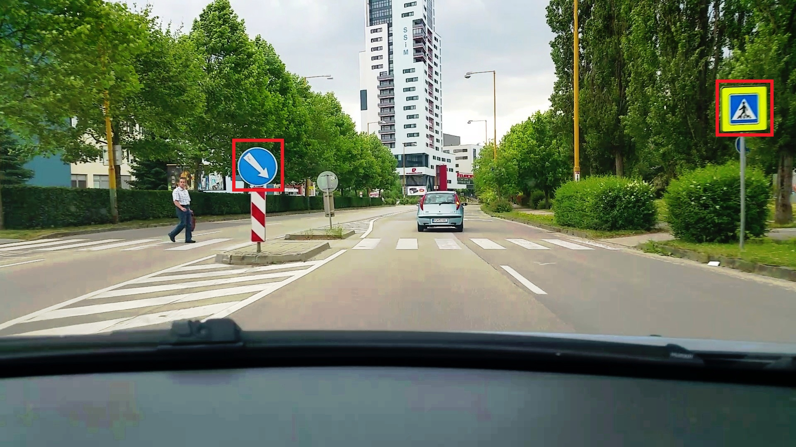
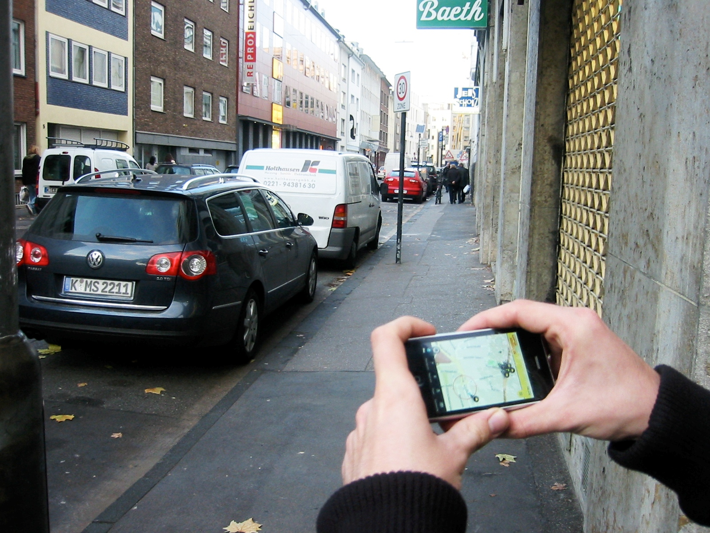

<!--
_header: ''
_footer: ''
_paginate: false
-->

# Object Position Estimation from a Single Moving Camera

*Ing. **Milan Ondrašovič*** $^1$,  milan.ondrasovic@fri.uniza.sk
*Ing. **Peter Tarábek**, PhD.* $^1$, peter.tarabek@fri.uniza.sk
*doc. Mgr. **Ondrej Šuch**, PhD.* $^2$, ondrej.such@fri.uniza.sk
\
$^1$ Faculty of Management Science and Informatics, University of Žilina
$^2$ Mathematical Institude SAV
\
\
International Conference on **Information and Digital Technologies 2021**

---
<!--
header: ''
paginate: true
-->

---

## We narrowed our focus down to the estimation of road sign GPS position estimation using a single dashboard camera and vehicle GPS position measurements.

---
## Given only a single uncalibrated moving camera and its position in the world...

## What is the position of the visible object, specifically, a road sign?

---

## The main contribution is an easy-to-implement method to estimate object position in images with no special hardware required.

---
<!--
header: Preliminaries
-->

---
# Angle computation

Calculation of a **relative angle** under which the center of **BBOX** is **visible on the frame**.

---
<!--
header: Methodology
_class: ''
-->
# Lines Intersection Method

* Abbreviated as **LIM**.
* Analogous to **tracing a ray** at the object of interest through the **optical center of the camera** from **two different positions** and subsequently computing the **point of intersection**.

---
<!--
_class: ''
-->

# Law of Sines Method

* Abbreviated as **LSM**.
* Construction of a **triangle** in the scene and then using the **law of sines** to compute the length of **one side** given **two other angles**.

---
<!--
_class: ''
-->

# Combining elementary position estimates

We computed a **refined position estimate** from **multiple elementary** position estimates.

---
<!--
header: Dataset creation
-->
# Synthetic dataset

* Created using [Blender](https://www.blender.org/) [1].
  * A free and open source $3D$ creation suite.
* $5$ different **scenarios**.
* Environment with **ideal conditions**.
* Various road **curvatures** and **elevations**.

---
# Synthetic dataset

* Road sign position with respect to **road side** varied, too.
* Only **one road sign** was present.
* Tested scenarios with **artificial noise**.

---
# Real dataset

* Recording in **Žilina**.
* $24$ frames per second.
* **GPS position** samples was obtained only **once** or **twice per second**.
* **Linear interpolation** to estimate the **GPS position** for **every frame**.

---
# Real dataset

**Google Maps** $+$ **mobile phone** $\to$ **real** road sign **GPS positions**.

---
# Dataset statistics

| Dataset name       | Hills | Elevation change | Curvature | Resolution         | Frames no. |
| ------------------ | ----- | ---------------- | --------- | ------------------ | ---------- |
| $\texttt{flat}$    | no    | yes              | yes       | $1280 \times 720$  | $254$      |
| $\texttt{hill}$    | yes   | yes              | yes       | $1280 \times 720$  | $130$      |
| $\texttt{up}$      | no    | no               | yes       | $1280 \times 720$  | $255$      |
| $\texttt{s-left}$  | no    | yes              | no        | $1280 \times 720$  | $32$       |
| $\texttt{s-right}$ | no    | yes              | no        | $1280 \times 720$  | $33$       |
| $\texttt{town}$    | no    | yes              | no        | $1920 \times 1080$ | $1474$     |

---
<!--
header: Experiments
_class: ''
-->

---
<!--
_class: ''
-->

---
<!--
_class: ''
-->

---
<!--
_class: ''
-->

---
<!--
header: Contribution
-->
# Conclusion

* **Position estimation** of a **road sign** from a **single camera** attached to a vehicle.
* We **developed**, **implemented**, and **tested** **two mathematical approaches** based on **triangulation**.
* We created a **synthetic** and a **real dataset**.
* **Position estimation accuracy** statistics:
  * On the **synthetic dataset**: below $1~m$.
  * On the **real dataset**: up to $4.3~m$ depending on the object-camera distance.

---
<!--
header: ''
-->
# References

[1] Link: https://www.blender.org/ (accessed on 22.6.2021).